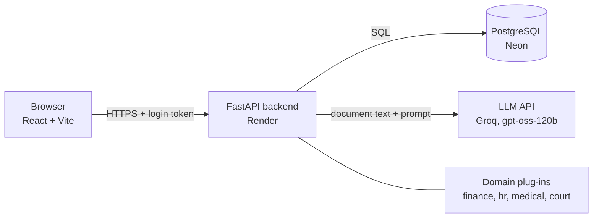
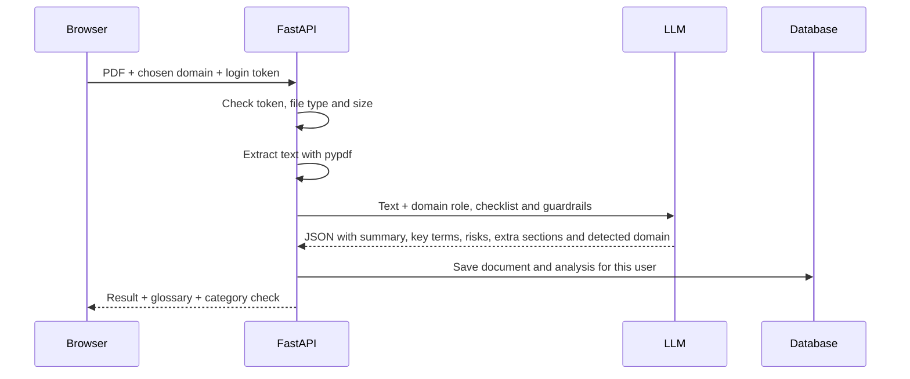

# ClearClause

**Understand what you sign, in plain English.**

ClearClause is a web app that reads a contract or legal document (PDF), explains it in simple language, flags risky clauses, and lets you ask questions about it. It is built around **domain plug-ins**: each kind of document (finance, HR, medical, court) is one configuration file, and each domain decides which sections and features it needs.

**Live demo:** https://clearclause-1b2g.onrender.com
**API docs:** https://clearclause-api-9d7a.onrender.com/docs

> The demo runs on free hosting. If nobody has used it for 15 minutes, the first load can take up to a minute while the server wakes up. The site shows a waiting screen and continues by itself.

| Login | Analysis |
|---|---|
|  |  |
| **Plain-English glossary** | **Chat with the document** |
|  |  |

## Contents

- [Team](#team)
- [Features](#features)
- [Domains](#domains)
- [Architecture](#architecture)
- [Tech stack](#tech-stack)
- [API overview](#api-overview)
- [Run it locally](#run-it-locally)
- [Project structure](#project-structure)
- [Security and privacy](#security-and-privacy)
- [Limitations](#limitations)
- [Future work](#future-work)
- [Disclaimer](#disclaimer)

## Team

Capstone project, VIT-AP University. Project guide: Dr. Karrothu Arvind.

| Member | Registration No. | Domain |
|---|---|---|
| Shrijay Pramod Naik | 23BCE8159 | Finance |
| Aravind Peetha | 23BCE9208 | Medical |
| Prashant Singh | 23BCE8122 | HR & Employment |
| Shatadru Adhikary | 23BCE8160 | Court & Legal Notices |

## Features

- Four domains: **Finance**, **HR & Employment**, **Medical**, and **Court & Legal Notices**
- Upload a PDF (text-based, up to 10 MB)
- Plain-language summary and key terms
- Risky clauses ranked high, medium or low, each with a plain-English meaning, why it is risky, and what to ask for
- Domain-specific sections: "Not mentioned in this document", "Ask HR before you sign", "Ask the insurer or hospital", and "What you need to do, and by when"
- Chat that answers only from the document and says so when something is not covered (switched off for HR, where a pre-signing checklist suits better)
- Glossary of the terms found in the document
- Wrong-category check: warns when a document looks like it belongs to a different domain and offers one-click re-analysis
- User accounts, with each user seeing only their own documents
- Saved history of analysed documents
- Friendly waiting screen while free hosting wakes up

## Domains

| | Finance | HR & Employment | Medical | Court & Legal Notices |
|---|---|---|---|---|
| **Typical documents** | Loans, credit cards, insurance | Offer letters, NDAs, service bonds | Health insurance, consent forms, discharge summaries | Legal notices, summons, orders, judgments |
| **Reader** | Borrower | Employee | Patient | Party concerned |
| **Summary, key terms, risk flags, glossary** | Yes | Yes | Yes | Yes |
| **Chat** | Yes | No | Yes, with safety rules | Yes |
| **Extra sections** | Not mentioned | Questions to ask HR, Not mentioned | Questions to ask, Not mentioned | Actions and deadlines |

**Safety rules per domain.** Each domain carries its own guardrails:

- **Finance:** never says whether to sign, and gives no investment or tax advice.
- **HR:** never tells the person to accept or reject an offer, and never declares a clause illegal.
- **Medical:** explains documents only. It never diagnoses, comments on medicines, or says whether a result is serious, and it sends emergencies to a doctor.
- **Court:** never predicts case outcomes, copies dates exactly as written, and never tells the person to ignore a notice.

### Wrong-category check

While analysing, the AI also reports which domain the document really belongs to. If that differs from the domain the user picked, the result page shows a banner with a **Re-analyse as ...** button, which reuses the saved text. The check is advisory only and never blocks the user, because AI classification can be wrong on borderline documents.

## Architecture



### What happens when you upload a document



### Domain plug-ins

Each domain is one small Python file in `backend/domains/` with a `CONFIG` dictionary that provides:

1. **role** and **reader**: who the AI acts as, and who it is explaining to
2. **risk_checklist** and **key_term_hints**: what to look for
3. **glossary**: plain-English definitions
4. **guardrails**: rules the AI must follow in this domain
5. **features** and **extra_sections**: which parts of the app this domain uses, for example chat on or off, or a deadlines section
6. **sections**, **disclaimer** and **upload_warning**: titles and notices shown in the interface

To add a domain, create `backend/domains/<name>.py`, import it in `backend/domains/__init__.py` and add it to the list there. A built-in checker reports any missing field when the server starts, and the interface picks up the new domain automatically.

## Tech stack

| Layer | Technology |
|---|---|
| Frontend | React, Vite, plain CSS |
| Backend | Python, FastAPI, Uvicorn |
| PDF text | pypdf |
| AI | Open-weight model `openai/gpt-oss-120b` through the Groq API (OpenAI-compatible) |
| Database | SQLite locally, PostgreSQL (Neon) in production, via SQLAlchemy |
| Auth | bcrypt password hashing, JWT tokens |
| Hosting | Render (backend and frontend), Neon (database), GitHub |

## API overview

| Method | Endpoint | Login needed | Purpose |
|---|---|---|---|
| GET | `/api/domains` | No | List domains and their settings |
| POST | `/api/auth/signup` | No | Create an account |
| POST | `/api/auth/login` | No | Log in and get a token |
| GET | `/api/me` | Yes | Current user |
| POST | `/api/analyze` | Yes | Upload a PDF and get the analysis |
| GET | `/api/documents` | Yes | List your documents |
| GET | `/api/documents/{id}` | Yes | Open one document |
| DELETE | `/api/documents/{id}` | Yes | Delete a document |
| POST | `/api/documents/{id}/reanalyze` | Yes | Re-run the analysis under a different domain |
| POST | `/api/chat` | Yes | Ask a question about a document |

## Run it locally

You need Python 3.11 or newer, Node.js 20 or newer, and a free [Groq](https://console.groq.com) API key.

**Backend**

```bash
cd backend
python -m venv venv
venv\Scripts\activate          # Windows (on Mac or Linux: source venv/bin/activate)
pip install -r requirements.txt
```

Create `backend/.env`:

```
GROQ_API_KEY=your_groq_key
LLM_MODEL=openai/gpt-oss-120b
SECRET_KEY=any_long_random_string
```

Then start it:

```bash
uvicorn main:app --reload
```

**Frontend** (in a second terminal)

```bash
cd frontend
npm install
npm run dev
```

Open http://localhost:5173.

### Environment variables

| Variable | Where | Purpose |
|---|---|---|
| `GROQ_API_KEY` | backend | Key for the LLM API |
| `LLM_MODEL` | backend | Model name |
| `SECRET_KEY` | backend | Signs login tokens |
| `DATABASE_URL` | backend | Postgres address (defaults to a local SQLite file) |
| `ALLOWED_ORIGINS` | backend | Websites allowed to call the API (CORS) |
| `VITE_API_URL` | frontend | Backend address, set at build time |

## Project structure

```
clearclause/
├── backend/
│   ├── main.py            # API endpoints
│   ├── ai_service.py      # LLM prompts: analysis and chat
│   ├── auth.py            # passwords and tokens
│   ├── models.py          # database tables
│   ├── database.py        # database connection
│   ├── pdf_utils.py       # PDF text extraction
│   └── domains/           # one file per domain
│       ├── finance.py
│       ├── hr.py
│       ├── medical.py
│       └── court.py
├── frontend/
│   └── src/
│       ├── App.jsx
│       ├── api.js
│       └── components/    # upload, results, chat, login, history, footer
└── docs/
    └── screenshots/
```

## Security and privacy

- Passwords are stored only as bcrypt hashes
- Logins use signed tokens that expire after 7 days
- Every database query is filtered by the logged-in user, so users cannot open each other's documents
- Secrets live in environment variables and are never committed to the repository
- Document text is sent to a third-party AI service (Groq) to produce summaries and answers. The app tells users this and asks them not to upload ID or bank account numbers
- Users can delete their documents at any time

## Limitations

- Scanned PDFs (images of text) are not supported yet
- Documents longer than about 20,000 characters are truncated
- Chat history is not saved, only documents and their analyses
- AI output can be wrong. It is general information, not legal, medical or financial advice
- The risk checklists and glossaries were drafted for demonstration and have not been reviewed by professionals
- The wrong-category check is advisory and can misjudge borderline documents
- Account deletion is not available yet
- Free hosting means slow first loads, and the free AI tier has rate limits

## Future work

- Retrieval-augmented generation (RAG) for long documents
- OCR for scanned documents
- Review of each domain's checklist and glossary by a subject expert
- Fine-tuning a smaller open model on clause-to-plain-English pairs
- Saved chat history, account deletion, and multi-language support

## Disclaimer

ClearClause provides general information and is not a substitute for advice from a qualified lawyer, doctor or financial advisor.
