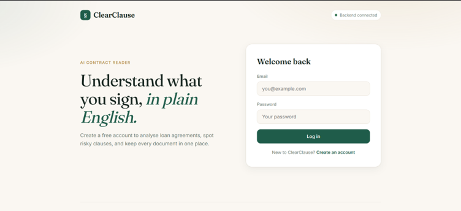
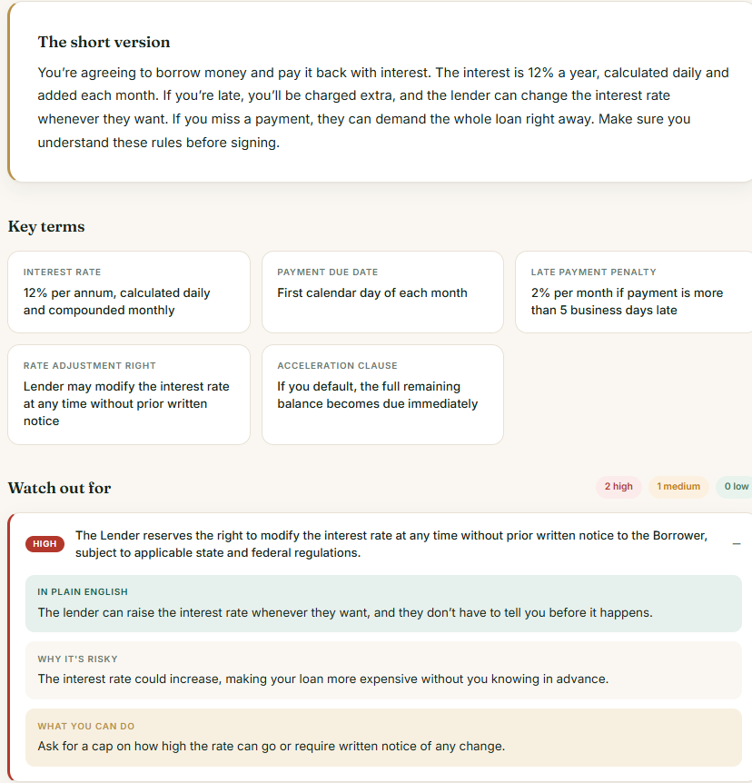
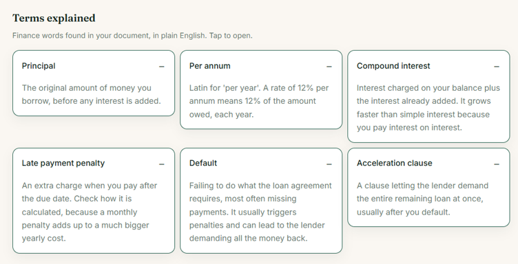
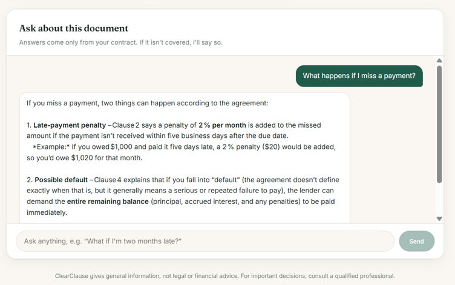
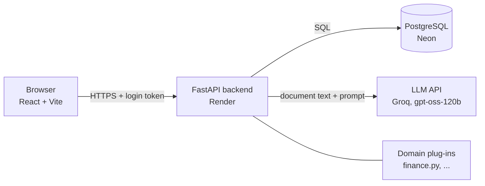
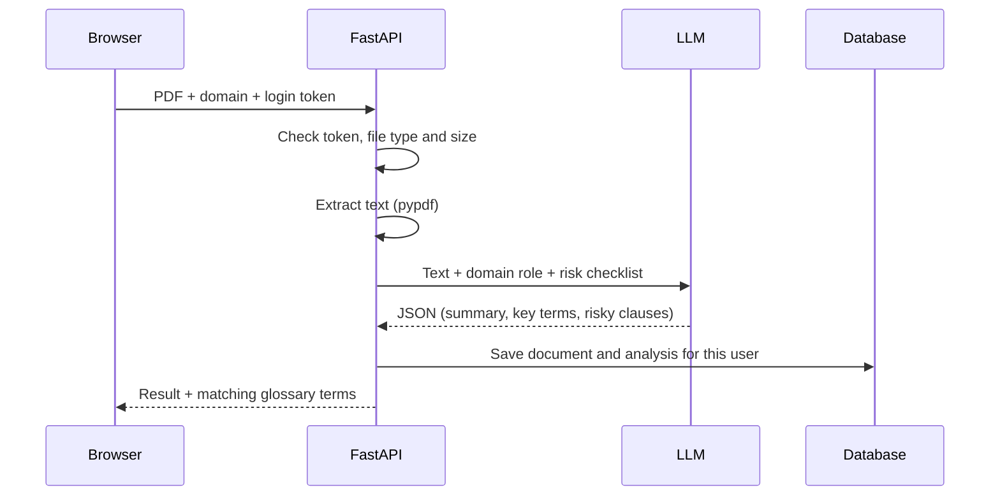

# ClearClause

**Understand what you sign, in plain English.**

ClearClause is a web app that reads a contract (PDF), explains it in simple language, flags risky clauses, and lets you ask questions about it. It is built around **domain plug-ins**, so the same app can serve different kinds of documents. The finance domain (loan agreements, credit card terms, insurance) is implemented first.

**Live demo:** https://clearclause-1b2g.onrender.com
**API docs:** https://clearclause-api-9d7a.onrender.com/docs

> The demo runs on free hosting. If nobody has used it for 15 minutes, the first load takes up to a minute while the server wakes up.

| Login | Analysis |
|---|---|
|  |  |
| **Plain-English glossary** | **Chat with the document** |
|  |  |

## Features

- Upload a PDF contract (text-based, up to 10 MB)
- Plain-language summary and key terms
- Risky clauses ranked high / medium / low, each with a plain-English meaning, why it is risky, and what to ask for
- Chat that answers only from the document and says so when something is not covered
- Glossary of the finance terms found in the document
- User accounts, with each user seeing only their own documents
- Saved history of analysed documents

## Architecture



### What happens when you upload a document



### Domain plug-ins

Each domain is one small Python file that provides:

1. **role**: who the AI should act as
2. **risk_checklist**: what to look for
3. **glossary**: plain-English definitions

To add a domain, create `backend/domains/<name>.py` with a `CONFIG` dictionary shaped like `finance.py`, then register it in `backend/domains/__init__.py`. The upload screen picks it up automatically.

## Tech stack

| Layer | Technology |
|---|---|
| Frontend | React, Vite, plain CSS |
| Backend | Python, FastAPI, Uvicorn |
| PDF text | pypdf |
| AI | Open-weight model `openai/gpt-oss-120b` through the Groq API (OpenAI-compatible) |
| Database | SQLite locally, PostgreSQL (Neon) in production, via SQLAlchemy |
| Auth | bcrypt password hashing, JWT tokens |
| Hosting | Render (backend and frontend), Neon (database), GitHub |

## API overview

| Method | Endpoint | Login needed | Purpose |
|---|---|---|---|
| GET | `/api/domains` | No | List available domains |
| POST | `/api/auth/signup` | No | Create an account |
| POST | `/api/auth/login` | No | Log in and get a token |
| GET | `/api/me` | Yes | Current user |
| POST | `/api/analyze` | Yes | Upload a PDF and get the analysis |
| GET | `/api/documents` | Yes | List your documents |
| GET | `/api/documents/{id}` | Yes | Open one document |
| DELETE | `/api/documents/{id}` | Yes | Delete a document |
| POST | `/api/chat` | Yes | Ask a question about a document |

## Run it locally

You need Python 3.11+, Node.js 20+ and a free [Groq](https://console.groq.com) API key.

**Backend**

```bash
cd backend
python -m venv venv
venv\Scripts\activate          # Windows (on Mac/Linux: source venv/bin/activate)
pip install -r requirements.txt
```

Create `backend/.env`:

```
GROQ_API_KEY=your_groq_key
LLM_MODEL=openai/gpt-oss-120b
SECRET_KEY=any_long_random_string
```

Then start it:

```bash
uvicorn main:app --reload
```

**Frontend** (in a second terminal)

```bash
cd frontend
npm install
npm run dev
```

Open http://localhost:5173.

### Environment variables

| Variable | Where | Purpose |
|---|---|---|
| `GROQ_API_KEY` | backend | Key for the LLM API |
| `LLM_MODEL` | backend | Model name |
| `SECRET_KEY` | backend | Signs login tokens |
| `DATABASE_URL` | backend | Postgres address (defaults to a local SQLite file) |
| `ALLOWED_ORIGINS` | backend | Websites allowed to call the API (CORS) |
| `VITE_API_URL` | frontend | Backend address, set at build time |

## Project structure

```
clearclause/
├── backend/
│   ├── main.py            # API endpoints
│   ├── ai_service.py      # LLM prompts: analysis and chat
│   ├── auth.py            # passwords and tokens
│   ├── models.py          # database tables
│   ├── database.py        # database connection
│   ├── pdf_utils.py       # PDF text extraction
│   └── domains/           # one file per domain
└── frontend/
    └── src/
        ├── App.jsx
        ├── api.js
        └── components/
```

## Limitations

- Scanned PDFs (images of text) are not supported yet
- Documents longer than about 20,000 characters are truncated
- Chat history is not saved, only documents and their analyses
- AI output can be wrong. It is general information, not legal or financial advice
- Free hosting means slow first loads, and the free AI tier has rate limits

## Future work

- Retrieval-augmented generation (RAG) for long documents
- OCR for scanned documents
- More domains: HR, medical, court and legal documents
- Fine-tuning a smaller open model on clause-to-plain-English pairs
- Saved chat history, account deletion, multi-language support

## Team

Capstone project, [University name].

| Domain | Member |
|---|---|
| Finance | [Your name] |
| HR | [Teammate] |
| Medical | [Teammate] |
| Court / legal | [Teammate] |

## Disclaimer

ClearClause provides general information and is not a substitute for advice from a qualified lawyer or financial advisor.